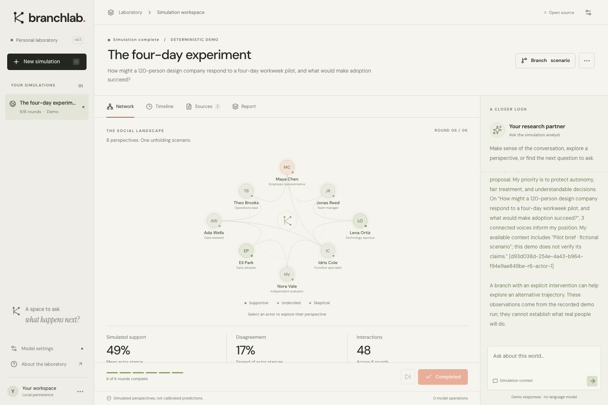
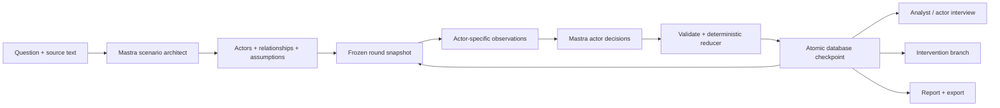

# Branchlab

**A laboratory for exploring how a scenario could unfold.**

Give Branchlab a question and supporting material. Build a cast of synthetic stakeholders, watch them interact, introduce a change, and ask what drove the result. Every completed round is saved so you can inspect the same history and compare a new branch with its starting point.

An original TypeScript application built with **Next.js, React, Mastra and libSQL**. MIT licensed. Runs locally without API keys in an explicitly labeled deterministic demo, or uses OpenAI, Gemini, Ollama and LM Studio.



## Get started

Requires Node.js **22.13+** and npm.

```sh
npm ci
cp .env.example .env.local
npm run dev
```

Open [localhost:3000](http://localhost:3000), choose **Explore a demo**, then inspect the actor network, advance rounds, ask the analyst a question, and create a branch with a changed condition. The local database is created at `.data/branchlab.db`. Demo responses are rule-based illustrations, not LLM outputs.

To use a live model, set `OPENAI_API_KEY` or `GOOGLE_GENERATIVE_AI_API_KEY` in `.env.local`, restart the server, and select the provider when creating a scenario. For local inference, set `ENABLE_LOCAL_MODELS=true` and start Ollama or LM Studio. [Model setup and current presets](docs/models.md).

## What you can do

- Create a scenario with 4–12 synthetic actors, explicit assumptions and source references.
- Import text, Markdown or CSV as source text; inspect the original material and content hashes.
- Explore actors and their relationships on an interactive network.
- Advance a single round, run multiple rounds, pause between rounds, and resume saved runs.
- Inspect individual actions, simulated support and disagreement over time.
- Interview an actor using its own observations, or discuss the run with an analyst.
- Fork the latest completed state with an intervention and compare its trajectory.
- Generate an event-linked report; export the complete run as JSON or a readable Markdown research record.
- Use a shared instance password, separate browser workspaces, bounded model calls and persistent operation locks.

## How it works



An actor sees its persona, own memories, assigned sources, and the previous public actions of its neighbors. Actors decide against the same snapshot, with at most three model calls in parallel. Ordinary TypeScript code validates identities and ranges and calculates aggregate metrics. An LLM cannot directly write database state or call arbitrary external tools.

Each HTTP operation executes at most one bounded round. Completed state is durable in the application's database; Mastra's per-round workflow is ephemeral. Closing the browser stops scheduling new rounds, and reopening the run resumes from the latest saved checkpoint. A crash within an unfinished round may repeat charged calls on retry. [Architecture and guarantees](docs/architecture.md).

## Deploy

**Vercel is the supported serverless target.** Import this repository as a Next.js project, provision a Turso database, and set `TURSO_DATABASE_URL`, `TURSO_AUTH_TOKEN` and `APP_PASSWORD`. Add the model credentials you want to enable. Use Node 22 or newer and Fluid Compute. No writable serverless filesystem is required for remote storage.

A Docker image is also provided for self-hosting with a persistent volume. Cloudflare Workers is not a tested deployment target for this version; the documented path uses Vercel's Node runtime. [Full deployment instructions](docs/deployment.md).

## Development

```sh
npm run typecheck
npm run lint
npm test
npx playwright install chromium
npm run build
npm run test:e2e
```

Unit/integration tests cover deterministic simulation behavior, observation isolation, evidence references, model configuration and persistence fencing. Browser tests cover the complete demo flow and mobile layout. Tests do not require paid credentials. Live-provider account access, output quality and remote hosting need validation in your own deployment.

| Location          | Responsibility                                                  |
| ----------------- | --------------------------------------------------------------- |
| `src/mastra/`     | Architect, actor decisions, workflow, demo engine, analyst      |
| `src/lib/`        | Shared types, input schemas, provider catalog, templates        |
| `src/server/`     | Model connections, SQL storage, sessions, limits, orchestration |
| `src/app/api/`    | Scoped, validated HTTP boundary                                 |
| `src/components/` | Simulation workspace and interactive views                      |
| `tests/`          | Engine, persistence, provider and browser checks                |
| `docs/`           | Research, architecture, models, deployment and API contract     |

## Interpreting the output

Branchlab explores **conditional simulated behavior**. Its support score is a normalized mean actor stance; disagreement is the standard deviation of stance. Neither is an empirically calibrated probability. Synthetic actors are not a representative sample of people, and a plausible explanation is not evidence of prediction accuracy.

The deterministic demo seed controls its rule-based behavior. Live LLM outputs can vary even with identical settings. JSON exports preserve recorded events for inspection; they do not promise reproducible model generation. Source IDs provide traceability to supplied material, not automatic verification that a model's interpretation is correct.

Current limits: text imports only (six sources, 16,000 characters each, 48,000 combined), 12 actors, 12 initial rounds, 24 rounds along a branch lineage and 40 questions per run. No web crawling, PDF extraction, million-agent execution, calibrated forecasting, background queue or multi-user collaboration is implied. [Research and methodology](docs/research.md).

## Contributing

See [CONTRIBUTING.md](CONTRIBUTING.md) for local setup and contribution expectations, and [SECURITY.md](SECURITY.md) for the deployment trust model. Third-party packages retain their own licenses; this repository's original code is MIT licensed. Self-hosted DM Sans and Instrument Serif fonts use the SIL Open Font License; their notices are preserved in `public/fonts/`.
