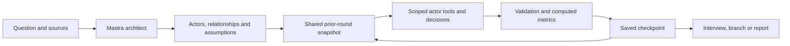

# Branchlab

**A world you can ask “what if?”**

Explore what-if scenarios through simulation chat. Run AI actors, inspect their interactions, and compare branching outcomes with Mastra.

Branchlab is an open-source application for turning a question into a small simulated world. Start a conversation, describe the conditions, and build a cast of synthetic actors with different goals, information and relationships. Follow their decisions over successive rounds, ask what drove a response, then change a condition and explore another branch.

Built with **Next.js, React, TypeScript and Mastra**. Use OpenAI or Gemini, connect Ollama or LM Studio, or explore the deterministic demo without API keys. Persist runs in SQLite, Turso or Neon/PostgreSQL. MIT licensed.


[See the simulation workspace](public/workspace.png) · [Creation progress in chat](public/progress.png) · [Automatic report in chat](public/report.png) · [Quick start](#quick-start) · [Models](docs/models.md) · [Deployment](docs/deployment.md) · [Architecture](docs/architecture.md)

## From a question to a possible future

> What if everyone had a personal robot?

Use that question to explore a world of households, workers, businesses and policymakers. Define what the robots can do, who pays for them, and what rules apply. Add supporting material when you want the actors to consider specific evidence.

1. **Describe the scenario in chat.** Branchlab's architect proposes actors, relationships and assumptions. Starting from the composer or detailed setup shows progress in chat, runs every configured round automatically, then writes the report. Reloading the running tab recovers its saved progress and continues without another click. You can pause after the current round; **Resume simulation** continues through all remaining rounds. **Run one round** is an explicit manual control. Titles are optional: chat history shows your chosen title, or the scenario prompt when you leave it blank.
2. **Watch it unfold.** Run a round or a bounded sequence. The chat shows actual execution progress: which phase is running, which permitted tools agents use, and when results are saved. When a run you start reaches its round limit, Branchlab prepares the analyst report in chat.
3. **Ask about the outcome.** Interview a worker about its response or ask the analyst to explain the simulated shift in support. Inspect the actors, events and cited material behind the answer.
4. **Change one condition.** For example, introduce a rule that robots cannot replace paid care workers. Branch from the latest completed state and advance that alternative.
5. **Read the answer and compare paths.** The report answers your original question first, then presents event-linked findings, metrics and uncertainties. Compare the original and the new branch and export the recorded history. If reporting fails, completed rounds stay saved and you can retry the report in chat.

The same workflow can explore a product launch, a policy proposal, an organizational change or a fictional society. You choose the question and assumptions; Branchlab makes the simulated interactions inspectable.

**These are conditional simulations, not calibrated forecasts.** Synthetic actors are not a representative sample of people. A plausible story does not establish what will happen in the real world.

## Who are the actors?

In **live mode**, the architect generates a new fictional cast for each scenario from your question, context and actor-visible sources. Each actor has a role, goal, modeled stance/influence, relationships and bounded memory. The cast is saved with the run; reopening it does not generate new people. These are synthetic perspectives, not real users, surveyed respondents or digital copies of named people.

An actor's community, research, operations or policy profile determines its permitted read tools. Each sees assigned evidence, its own memory and bounded observations of connected actors—not another actor's private memory or analyst-only sources. The workspace owner can inspect the stored cast and memories. **Demo mode** instead uses fixed category-specific archetypes and deterministic English templates; its roster does not constrain live generation. The interface is English. Live worlds, actor actions and reports follow the original scenario's language; chat and interviews follow your latest question's language. [Persona and tool boundaries](docs/agent-runtime.md).

## Quick start

Requires **Node.js 22.13 or newer** and npm. From the repository directory:

```sh
npm ci
cp -n .env.example .env.local
npm run dev
```

`npm run dev` prepares the database before starting Next.js and stops with a safe error if preparation fails. To prepare it separately after configuring `.env.local`, run **`npm run db:prepare`**; no application server is needed. The command preserves existing data and closes its connection. `npm ci` and `npm run build` do not prepare or connect to the database. [Preparation and environment precedence](docs/deployment.md#prepare-the-database).

Open [localhost:3000](http://localhost:3000) and choose **Explore a demo**. The demo uses deterministic rules and is visibly labeled; it does not call an LLM. SQLite defaults to `.data/branchlab.db`. `cp -n` preserves an existing `.env.local`. Opening a workspace still loads configuration, its browser session and saved history; a remote database may need to wake from inactivity.

For live inference, add **one** provider key to `.env.local`, restart the server, then select that provider when creating a scenario. When Google is configured, Gemini 3.8 Flash is preselected; cloud processing still requires your consent. Simulation and branch names are optional. An unnamed simulation is saved as **Untitled simulation**; its question stays separate.

```dotenv
OPENAI_API_KEY=your-openai-key
# Or:
GOOGLE_GENERATIVE_AI_API_KEY=your-google-key
```

For Ollama or LM Studio, enable `ENABLE_LOCAL_MODELS=true` and start your model server. Local models must support both tool calling and structured responses. See [model setup](docs/models.md) for presets, endpoint rules and troubleshooting. Provider errors remain visible; a failed live run never silently becomes a demo.

## Explore, inspect and branch

| Capability                  | What it gives you                                                                                                                                           |
| --------------------------- | ----------------------------------------------------------------------------------------------------------------------------------------------------------- |
| Chat and scenario setup     | A conversational starting point, with detailed controls for assumptions, sources and 4–12 actors.                                                           |
| Distinct actor capabilities | Community, research, operations and policy profiles with scoped tools and observations.                                                                     |
| Source controls             | Text, Markdown and CSV imports; original material and hashes; analyst-only sources excluded from the architect and actors.                                  |
| Visible execution           | Real phase and tool activity, durations, safe errors and saved operation history. Activity summaries do not expose private model reasoning.                 |
| Simulation workspace        | An interactive actor network, event timeline, simulated support/disagreement, actor interviews and analyst chat.                                            |
| Interventions and records   | Branches from saved checkpoints, trajectory comparison, event-linked reports, JSON and Markdown exports.                                                    |
| Optional web search         | Brave search for research actors, requiring both server configuration and separate per-run consent. Result URLs are not fetched.                            |
| Saved progress              | Database checkpoints, bounded runs, pause between rounds and workspace erasure. Failed creation offers Retry or Edit, preserving inputs in the current tab. |

## How the agents work



Each actor receives its own persona and memories, assigned evidence, and bounded observations of its neighbors' prior actions. Actors decide against the same frozen snapshot, with at most three actor agents running in parallel. The analyst has a broader view of source material and recorded public events.

Mastra provides the agents, tools and per-round workflow. Ordinary TypeScript code validates generated actions, checks references, calculates metrics and commits state. Live agents must use a permitted read tool before synthesis, with at most three model steps and two tool executions. The server controls persistence and network destinations. [Agent capabilities and information boundaries](docs/agent-runtime.md).

Every HTTP operation runs at most one bounded round. Application database checkpoints are durable; the Mastra workflow itself is ephemeral. The tab remembers an explicitly started run and reconciles its server operation before continuing after a reload. It waits for work already in progress and reuses committed results; failed or interrupted operations stop with an error rather than silently repeating model calls. Closing the browser stops scheduling new rounds; there is no background worker. Paused runs and saved runs without an active start request remain stopped. [Architecture and execution guarantees](docs/architecture.md).

## Deploy your own instance

**Vercel** is the supported serverless target; **Docker** and persistent Node servers are also supported. Hosted deployments need Neon/PostgreSQL or Turso. Local SQLite needs a persistent filesystem. Cloudflare Workers is not a tested target for this version.

For Vercel, configure the remote database, set `APP_PASSWORD` and your exact `APP_ORIGIN`, add any model credentials, and enable Fluid Compute with the required execution duration. Follow the [deployment guide](docs/deployment.md) for complete Vercel and Docker instructions, database permissions, TLS and runtime limits.

For Neon, use the pooled connection URL as `DATABASE_URL`. It takes precedence over Turso settings. PostgreSQL uses a dedicated **`branchlab` schema** by default. An existing, compatible Branchlab installation in `public` must explicitly set `DATABASE_SCHEMA=public` to keep using that data. Changing schemas does not move records; startup rejects incompatible tables without repairing or deleting them. [Database setup and schema selection](docs/deployment.md#neon--postgresql).

## Privacy and practical limits

Branchlab is designed for a **personal or small trusted instance**. An optional local instance password becomes required for hosted live inference; configure `APP_PASSWORD` before exposing a deployment. Browser workspaces are isolated, but this is not an organization account system, team RBAC or account recovery. Cloud credentials stay on the server.

New cloud scenarios require processing consent. Web search is a separate opt-in and requires `BRAVE_SEARCH_API_KEY`; queries can contain scenario-derived information. A local model endpoint may run on another machine, so selecting Ollama or LM Studio does not by itself guarantee on-device processing.

Settings shows storage and retention information and can erase the browser's workspace, including its runs and execution records. Erasure revokes pending writes; it cannot remove upstream provider records or operator backups. Sessions expire 30 days after creation, and expired workspace data is cleaned on subsequent application traffic. [Privacy and retention](docs/privacy.md) · [Security model](SECURITY.md).

Current bounds include **12 actors**, **12 initial rounds**, **24 rounds along a branch lineage**, **40 questions per run**, and six text sources of up to 16,000 characters each / 48,000 combined. There is no PDF extraction, arbitrary crawling or unattended background runner. See [runtime limits](docs/deployment.md#operations-and-limits) and the [API contract](docs/implementation-contract.md).

Support is a normalized mean actor stance; disagreement is the standard deviation of stance. Neither is a real-world probability. Live model output may vary with identical settings, and exports preserve recorded history rather than reproducible generation. Source references provide traceability, not automatic proof that the model interpreted evidence correctly. [Research and methodology](docs/research.md).

## Development and contributing

```sh
npm run typecheck
npm run lint
npm test
npx playwright install chromium
npm run build
npm run test:e2e
```

Offline tests exercise real Mastra/SDK protocols with controlled model responses, plus permissions, validation, cancellation, idempotency, safe errors and persistence. CI includes a disposable PostgreSQL service. Browser tests cover the chat workflow, accessibility, mobile layout and failure recovery. Tests do not need paid credentials and do not establish forecasting accuracy; validate provider access and hosted configuration with your own accounts.

| Location          | Responsibility                                                               |
| ----------------- | ---------------------------------------------------------------------------- |
| `src/mastra/`     | Architect, actors, tools, workflow, demo engine and analyst                  |
| `src/lib/`        | Shared types, validation, provider catalog and templates                     |
| `src/server/`     | Model connections, SQL adapters, sessions, privacy, traces and orchestration |
| `src/app/api/`    | Scoped HTTP routes                                                           |
| `src/components/` | Chat and simulation workspace                                                |
| `tests/`          | Engine, persistence, provider and browser checks                             |
| `docs/`           | Architecture, runtime, models, deployment, privacy and research              |

See [CONTRIBUTING.md](CONTRIBUTING.md) for contribution expectations. Original project code is [MIT licensed](LICENSE); dependencies retain their own licenses. The self-hosted DM Sans and Instrument Serif fonts use the SIL Open Font License, with notices in `public/fonts/`.
